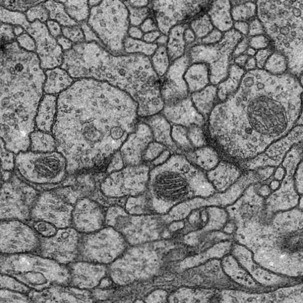

# Skin-cancer-segmentation
This dataset is obtained from Kaggle. An Open Kaggle challenge was hosted where people were told to make a model to segment images. The dataset consists of 30 images as Training set images and it has 30 respective labelled images. The test set contains of 30 images with no labelled images. I have provided label images for reference in this repository.

### Example images (Train vs label images)
</img>&emsp;&emsp;&emsp;</img>

&emsp;&emsp;&emsp;&emsp;&emsp;&emsp;&emsp;Train image 0&emsp;&emsp;&emsp;&emsp;&emsp;&emsp;&emsp;&emsp;&emsp;&emsp;&emsp;&emsp;&emsp;&emsp;&emsp;&emsp;Label image 0

&emsp;&emsp;&emsp;

&emsp;&emsp;&emsp;&emsp;&emsp;&emsp;&emsp;Train image 1&emsp;&emsp;&emsp;&emsp;&emsp;&emsp;&emsp;&emsp;&emsp;&emsp;&emsp;&emsp;&emsp;&emsp;&emsp;&emsp;Label image 1

## Model Architecture

<a href="files/Unet.pdf"><b>U-net architecture</b></a>  
I haven't explained much about U-net architecture here. Please go to the link to learn more about U-net architecture.   

<b>Loss Function used:</b> Binary Crossentropy

<b>Metrics used:</b> <a href="https://towardsdatascience.com/metrics-to-evaluate-your-semantic-segmentation-model-6bcb99639aa2#:~:text=Simply%20put%2C%20the%20Dice%20Coefficient,of%20pixels%20in%20both%20images.&text=They%20are%20positively%20correlated%2C%20meaning,other%20will%20say%20the%20same." target="_blank">Dice Coefficient</a> 

## Implementation accuracy
<b>Train set accuracy:</b> 91.16% 
<b>Validation set accuracy :</b> 91.88% 

We can see that accuracy is quite good. The model was trained for 50 epochs. With a bit of tweaking of models layers, dropouts etc and training the model for 100 epochs or more will result in very high accuracy. It takes up a lot of resources and time, hence I haven't implemented it for now. You can try it and do tell me what accuracies you get.

## Model predictions
The following images are Test set image, Label image, and image predicted by the model.

</img> 
&emsp;&emsp;&emsp;&emsp;&emsp;&emsp;&emsp;Train Image 1

</img>&emsp;&emsp;&emsp;</img>

&emsp;&emsp;&emsp;&emsp;&emsp;&emsp;&emsp;Label Image 1&emsp;&emsp;&emsp;&emsp;&emsp;&emsp;&emsp;&emsp;&emsp;&emsp;&emsp;&emsp;&emsp;&emsp;&emsp;&emsp;Predicted Image 1

</img> 
&emsp;&emsp;&emsp;&emsp;&emsp;&emsp;&emsp;Train Image 2

</img>&emsp;&emsp;&emsp;</img>

&emsp;&emsp;&emsp;&emsp;&emsp;&emsp;&emsp;Label Image 2&emsp;&emsp;&emsp;&emsp;&emsp;&emsp;&emsp;&emsp;&emsp;&emsp;&emsp;&emsp;&emsp;&emsp;&emsp;&emsp;Predicted Image 2

## The following additional plots and charts were made to understand the model beter.
<b>Loss vs Epochs</b>

<b>Dice coefficient vs Epochs</b>

  

<b>Note:</b> Go through the Jupyter Notebook. Each step has been explained briefly.
